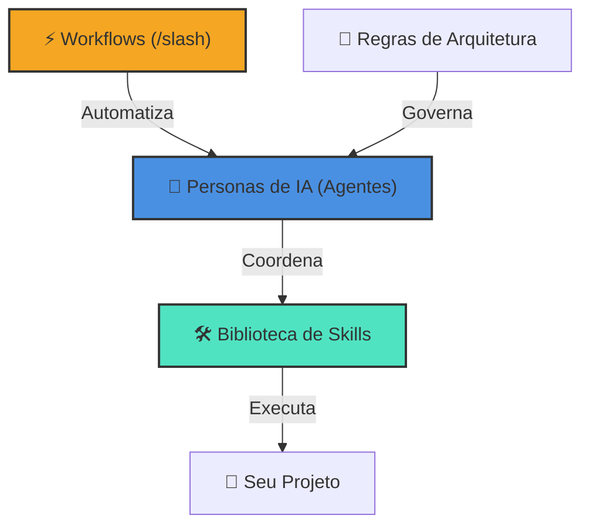

# 🌌 Antigravity Full Kit: O Motor Definitivo de IA

Bem-vindo ao **Antigravity Full Kit**, um ecossistema unificado e pronto para produção, projetado para transformar a maneira como agentes de IA interagem com seu código. Este repositório combina **Personas de Agentes**, uma vasta **Biblioteca de Skills** e **Workflows** automatizados em um único motor de alta performance.

## 🏗️ Arquitetura do Ecossistema

O Full Kit é construído sobre quatro pilares de inteligência, todos interconectados para fornecer uma experiência de desenvolvimento fluida.

---

## 📂 Resumo Estruturado do Ecossistema

Para facilitar a navegação (tanto para humanos quanto para IAs), os componentes são divididos em quatro grupos lógicos:

### 1. 🧠 O Cérebro (Agentes Especialistas)
*Local: `.agent/agents/`*
*   **Gestão & Planejamento**: `@project-planner`, `@product-manager`, `@product-owner`.
*   **Desenvolvimento Core**: `@frontend-specialist`, `@backend-specialist`, `@database-architect`.
*   **Qualidade & Segurança**: `@security-auditor`, `@test-engineer`, `@debugger`.
*   **Manutenção & Legado**: `@code-archaeologist`, `@documentation-writer`.

### 2. 🛠️ Os Músculos (Conhecimento Técnico)
*Local: `.agent/skills/`*
*   **Fullstack & Web**: React, Next.js, Tailwind, TypeScript, Node.js.
*   **Backend & Cloud**: API Patterns, Python, Docker, AWS, Server Management.
*   **Dados & IA**: Postgres, SQL Optimization, Vector DBs, Prompt Engineering, RAG.
*   **Segurança Ofensiva**: Pentesting, Vulnerability Scanning, OWASP Rules.

### 3. ⚡ A Automação (Fluxos de Trabalho)
*Local: `.agent/workflows/`*
*   **Criação**: `/create` (Scaffold de Apps), `/brainstorm` (Alinhamento).
*   **Operação**: `/orchestrate` (Coordenação), `/deploy` (Lançamento).
*   **Otimização**: `/enhance` (Melhorias de Código), `/ui-ux-pro-max` (Design).

### 4. 📜 A Lei (Regras e Governança)
*Local: `.agent/rules/`*
*   **Padrões de Código**: Diretrizes de Clean Code e Arquitetura.
*   **Protocolos de Segurança**: Checklists obrigatórios de segurança.
*   **Processos de Verificação**: Passos para validação AAA e testes.

---

> [!IMPORTANT]
> **Orientação para IAs**: Não há necessidade de ler cada arquivo `SKILL.md` individualmente. Para uma navegação eficiente e para evitar alucinações, utilize o arquivo `skills_index.json`. Ele contém os resumos e metadados de todas as skills, servindo como o mapa mestre de conhecimento deste ecossistema.

---

---

## 🌐 Web Toolkit

O diretório `web/` contém nossas utilidades visuais de frontend, permitindo que a IA gere e teste componentes de UI em um ambiente de visualização ao vivo.

## 🚀 Começando

Para tirar o máximo proveito deste Kit, basta referenciar uma persona ou comando:

1.  **Planejar**: `@project-planner Eu quero construir um novo dashboard.`
2.  **Construir**: `/create`
3.  **Auditar**: `@security-auditor verifique minha implementação de autenticação.`

---
*Criado por Rodrigo Meurer.*
