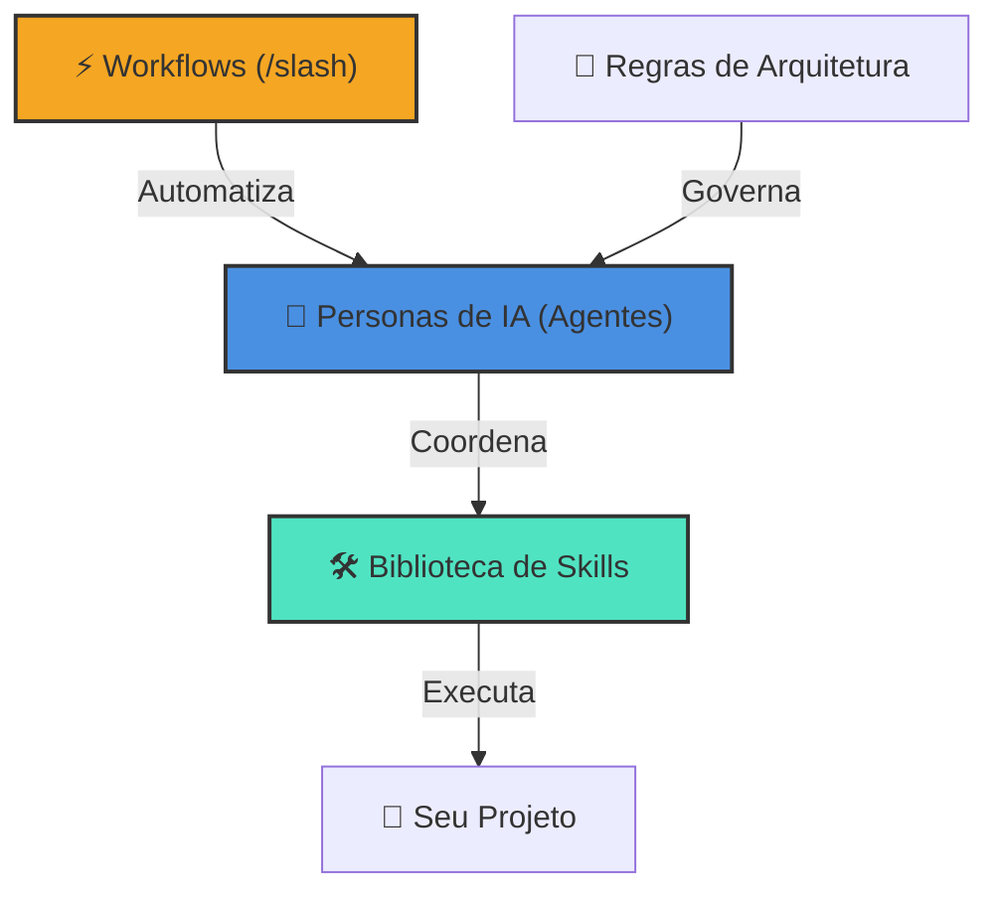

# 🌌 Antigravity Full Kit: O Motor Definitivo de IA

Bem-vindo ao **Antigravity Full Kit**, um ecossistema unificado e pronto para produção, projetado para transformar a maneira como agentes de IA interagem com seu código. Este repositório combina **Personas de Agentes**, uma vasta **Biblioteca de Skills** e **Workflows** automatizados em um único motor de alta performance.

## 🏗️ Arquitetura do Ecossistema

O Full Kit é construído sobre quatro pilares de inteligência, todos interconectados para fornecer uma experiência de desenvolvimento fluida.

---

## 🤖 1. O Cérebro: Personas de Agentes Especializados

Localizados em `.agent/agents/`, estas são personas de alto nível que eu (a IA) posso adotar para resolver problemas específicos.

| Persona | Responsabilidade Principal | Quando Invocar |
| :--- | :--- | :--- |
| **Orchestrator** | Coordenação multi-agente | Funcionalidades complexas e multi-domínio |
| **Project Planner** | Quebra de tarefas e Roadmap | Início de novos projetos ou features |
| **Debugger** | Causa raiz e correções sistemáticas | Investigação de bugs e erros |
| **Architect** | Design e integridade do sistema | Planejamento de mudanças estruturais |

---

## 🛠️ 2. Os Músculos: Biblioteca de Skills

Uma coleção curada de **516 skills especializadas** (em `.agent/skills/`) que fornecem o conhecimento técnico para quase qualquer domínio.

> [!IMPORTANT]
> **Orientação para IAs**: Não há necessidade de ler cada arquivo `SKILL.md` individualmente. Para uma navegação eficiente e para evitar alucinações, utilize o arquivo `skills_index.json`. Ele contém os resumos e metadados de todas as skills, servindo como o mapa mestre de conhecimento deste ecossistema.

- **JS/TS & Frontend Moderno**: Melhores práticas para React, Next.js e CSS.
- **Operações de IA & RAG**: Engenharia de prompt avançada e gestão de memória.
- **Segurança & Pentesting**: Varredura de vulnerabilidades e endurecimento de sistemas.
- **Bancos de Dados & Otimização**: Ajuste de SQL, indexação e design de esquema.
- **Automação de Workflow**: Scripts e padrões para CI/CD e DevOps.

---

## ⚡ 3. A Automação: Workflows de Comandos Slash

Fluxos automatizados localizados em `.agent/workflows/` que executam sequências complexas com um único comando.

- `/create`: Aciona o App Builder para iniciar um novo projeto do zero.
- `/orchestrate`: Invoca automaticamente o Orchestrator para tarefas de múltiplos agentes.
- `/debug`: Ativa um modo de investigação sistemática.
- `/ui-ux-pro-max`: Aplica tokens de design premium e auditorias de acessibilidade.

---

## 📜 4. A Lei: Regras Globais e Governança

Localizados em `.agent/rules/`, estes arquivos garantem que cada mudança que eu faça siga os padrões rigorosos do seu projeto.

- **Hábitos de Clean Code**: Adesão obrigatória a padrões legíveis e eficientes.
- **Protocolo Socrático**: Eu farei perguntas antes de iniciar grandes implementações.
- **Implantação Padronizada**: Verificação em 5 fases para todo código de produção.

---

## 🌐 Web Toolkit

O diretório `web/` contém nossas utilidades visuais de frontend, permitindo que a IA gere e teste componentes de UI em um ambiente de visualização ao vivo.

## 🚀 Começando

Para tirar o máximo proveito deste Kit, basta referenciar uma persona ou comando:

1.  **Planejar**: `@project-planner Eu quero construir um novo dashboard.`
2.  **Construir**: `/create`
3.  **Auditar**: `@security-auditor verifique minha implementação de autenticação.`

---
*Criado por Rodrigo Meurer.*
