# 🌌 Antigravity Full Kit: The Ultimate AI Engine

Welcome to the **Antigravity Full Kit**, a unified, production-ready ecosystem designed to transform how AI agents interact with your codebase. This repository combines **Agent Personas**, a vast **Skills Library**, and automated **Workflows** into a single high-performance engine.

## 🏗️ Ecosystem Architecture

The Full Kit is built on four interconnected pillars of intelligence, providing a seamless development experience.

```mermaid
graph TD
    A["🧠 AI Personas (Agents)"] -->|Coordinates| B["🛠️ Skills Library"]
    B -->|Executes| C["📂 Your Project"]
    D["⚡ Workflows (/slash)"] -->|Automates| A
    E["📜 Architecture Rules"] -->|Governs| A
    style A fill:#4a90e2,stroke:#333,stroke-width:2px
    style B fill:#50e3c2,stroke:#333,stroke-width:2px
    style D fill:#f5a623,stroke:#333,stroke-width:2px
```

---

## 📂 Structured Ecosystem Summary

To facilitate navigation (for both humans and AIs), components are divided into four logical groups:

### 1. 🧠 The Brain (Specialist Agents)
*Location: `.agent/agents/`*
*   **Management & Planning**: `@project-planner`, `@product-manager`, `@product-owner`.
*   **Core Development**: `@frontend-specialist`, `@backend-specialist`, `@database-architect`.
*   **Quality & Security**: `@security-auditor`, `@test-engineer`, `@debugger`.
*   **Maintenance & Legacy**: `@code-archaeologist`, `@documentation-writer`.

### 2. 🛠️ The Muscle (Technical Knowledge)
*Location: `.agent/skills/`*
*   **Fullstack & Web**: React, Next.js, Tailwind, TypeScript, Node.js.
*   **Backend & Cloud**: API Patterns, Python, Docker, AWS, Server Management.
*   **Data & AI**: Postgres, SQL Optimization, Vector DBs, Prompt Engineering, RAG.
*   **Offensive Security**: Pentesting, Vulnerability Scanning, OWASP Rules.

### 3. ⚡ The Automation (Workflows)
*Location: `.agent/workflows/`*
*   **Creation**: `/create` (App Scaffolding), `/brainstorm` (Alignment).
*   **Operation**: `/orchestrate` (Coordination), `/deploy` (Launch).
*   **Optimization**: `/enhance` (Code Improvements), `/ui-ux-pro-max` (Design).

### 4. 📜 The Law (Rules & Governance)
*Location: `.agent/rules/`*
*   **Code Standards**: Clean Code and Architecture Guidelines.
*   **Security Protocols**: Mandatory security checklists.
*   **Verification Processes**: AAA validation and testing steps.

---

> [!IMPORTANT]
> **Guidance for AIs**:
> 1. **Skills**: No need to read every `SKILL.md` file individually. Use `skills_index.json` to avoid hallucinations.
> 2. **Architecture**: To deeply understand the ecosystem's structure and capabilities, read `.agent/ARCHITECTURE_KIT.md` before planning complex tasks.

---

---

## 🌐 Web Toolkit

The `web/` directory contains our visual frontend utilities, allowing AI to generate and test UI components in a live preview environment.

## 🚀 Getting Started

To get the most out of this Kit, simply reference a persona or command:

1.  **Plan**: `@project-planner I want to build a new dashboard.`
2.  **Build**: `/create`
3.  **Audit**: `@security-auditor check my authentication implementation.`

---
*Created by Rodrigo Meurer.*
