# 🌌 Antigravity Full Kit: The Ultimate AI Engine

Welcome to the **Antigravity Full Kit**, a unified, production-ready ecosystem designed to transform how AI agents interact with your codebase. This repository combines **Agent Personas**, a vast **Skills Library**, and automated **Workflows** into a single high-performance engine.

---

## 🚀 Quick Start

### Installation

1. **Clone the repository**
   ```bash
   git clone https://github.com/rmmeurer/antigravity-fullkit.git
   cd antigravity-fullkit
   ```

2. **Run the setup script** (Windows PowerShell)
   ```powershell
   .\setup.ps1
   ```
   
   Or manually:
   ```bash
   cd .agent/skills
   npm install
   npm run build
   ```

3. **Verify installation**
   - Check that `skills_index.json` was generated in `.agent/skills/`
   - Confirm 516 skills are indexed

### How to Use

Point your AI assistant to this repository and use one of these methods:

**Method 1: Agent Personas**
```
@project-planner Create a roadmap for my e-commerce platform
@frontend-specialist Build a responsive navbar with dark mode
@security-auditor Review my authentication implementation
```

**Method 2: Slash Commands**
```
/create          → Start a new project from scratch
/orchestrate     → Coordinate multiple agents for complex tasks
/debug           → Activate systematic debugging mode
/ui-ux-pro-max   → Apply premium design patterns
```

**Method 3: Direct Skill Access**
```
Use the nextjs-expert skill to optimize my app routing
Apply the clean-code skill to refactor this module
```

---

## 🏗️ Ecosystem Architecture

```mermaid
graph TB
    A["⚡ Workflows (/slash)"]
    B["📜 Architecture Rules"]
    C["🧠 AI Personas (Agents)"]
    D["🛠️ Skills Library<br/>(516 modules)"]
    E["📂 Your Project"]
    
    A -->|Automates| C
    B -->|Governs| C
    C -->|Coordinates| D
    D -->|Executes| E
    
    style A fill:#10b981,stroke:#059669,stroke-width:3px,color:#fff
    style B fill:#065f46,stroke:#064e3b,stroke-width:3px,color:#fff
    style C fill:#3b82f6,stroke:#2563eb,stroke-width:3px,color:#fff
    style D fill:#10b981,stroke:#059669,stroke-width:3px,color:#fff
    style E fill:#065f46,stroke:#064e3b,stroke-width:3px,color:#fff
```



---

## 📂 What's Inside

### 1. 🧠 The Brain (Specialist Agents)
*Location: `.agent/agents/`*

Specialized AI personas you can invoke for different tasks:

*   **Management & Planning**: `@project-planner`, `@product-manager`, `@product-owner`
*   **Core Development**: `@frontend-specialist`, `@backend-specialist`, `@database-architect`
*   **Quality & Security**: `@security-auditor`, `@test-engineer`, `@debugger`
*   **Maintenance & Legacy**: `@code-archaeologist`, `@documentation-writer`

### 2. 🛠️ The Muscle (Technical Knowledge)
*Location: `.agent/skills/`*

516 curated skills covering:

*   **Fullstack & Web**: React, Next.js, Tailwind, TypeScript, Node.js
*   **Backend & Cloud**: API Patterns, Python, Docker, AWS, Server Management
*   **Data & AI**: Postgres, SQL Optimization, Vector DBs, Prompt Engineering, RAG
*   **Offensive Security**: Pentesting, Vulnerability Scanning, OWASP Rules

### 3. ⚡ The Automation (Workflows)
*Location: `.agent/workflows/`*

Pre-built command sequences:

*   **Creation**: `/create` (App Scaffolding), `/brainstorm` (Requirement Alignment)
*   **Operation**: `/orchestrate` (Multi-Agent Coordination), `/deploy` (Production Launch)
*   **Optimization**: `/enhance` (Code Improvements), `/ui-ux-pro-max` (Premium Design)

### 4. 📜 The Law (Rules & Governance)
*Location: `.agent/rules/`*

Enforced standards:

*   **Code Standards**: Clean Code and Architecture Guidelines
*   **Security Protocols**: Mandatory security checklists
*   **Verification Processes**: AAA validation and testing steps

---

> [!IMPORTANT]
> **Guidance for AIs**:
> 1. **Skills**: No need to read every `SKILL.md` file individually. Use `skills_index.json` to avoid hallucinations.
> 2. **Architecture**: To deeply understand the ecosystem's structure and capabilities, read `.agent/ARCHITECTURE_KIT.md` before planning complex tasks.

---

## 📖 Documentation

- **[ARCHITECTURE_KIT.md](.agent/ARCHITECTURE_KIT.md)** - Detailed technical architecture
- **[CHANGELOG.md](CHANGELOG.md)** - Version history and updates
- **[LICENSE](LICENSE)** - MIT License

---

## 🌐 Web Toolkit

The `web/` directory contains visual frontend utilities for live UI component testing and generation.

---

## 🤝 Contributing

This is a curated ecosystem. To suggest improvements:

1. Review the existing structure in `.agent/ARCHITECTURE_KIT.md`
2. Ensure your contribution follows the Clean Code standards in `.agent/rules/`
3. Submit a detailed pull request

---

*Created by Rodrigo Meurer*
